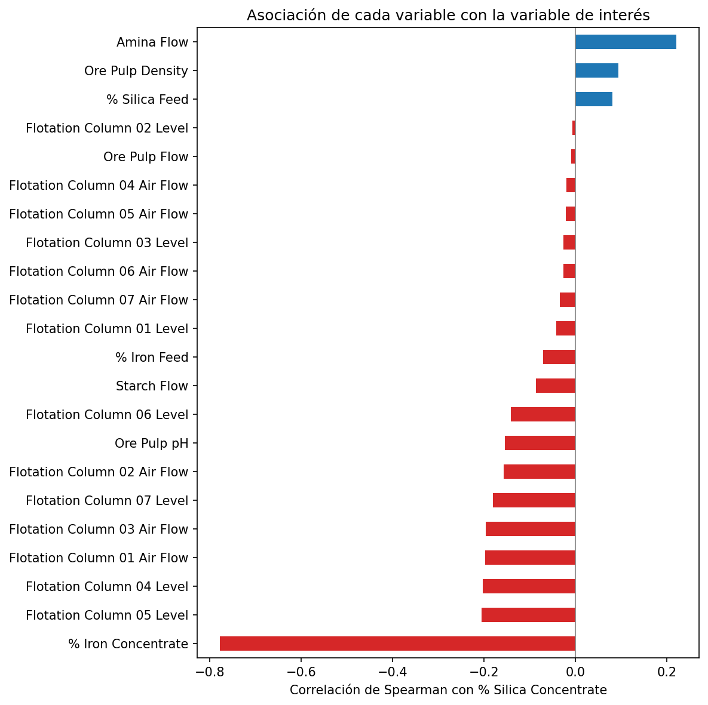

# EDA: Planta de flotación de mineral de hierro

Análisis exploratorio de datos (EDA) sobre datos operativos reales de una planta de flotación inversa de mineral de hierro. El proyecto diagnostica la calidad de los datos, caracteriza el comportamiento del proceso e identifica qué variables se asocian a la variabilidad del **% de sílice en el concentrado final**, la medida de calidad comercial del producto.

**Autor:** Jesús Muñoz Sánchez — Ingeniero Industrial | Análisis de Datos
[LinkedIn](https://www.linkedin.com/in/j-munoz-ind/) · [GitHub](https://github.com/jmunoz-ind/eda-planta-flotacion-hierro)

---

## Resumen ejecutivo

Diagnóstico de un dataset industrial de 737k registros que reveló dos problemas no documentados: la resolución real es horaria (no de 20s) y ~28% de las horas contienen datos sintéticos (interpolados o congelados). Sobre 4097 observaciones
horarias limpias, el % de sílice del concentrado (CV 48%) concentra el riesgo de calidad y se asocia al flujo de amina y a los niveles de las columnas 04–05. La calidad no es estacionaria: abril–mayo concentran la mayor impureza.

## Pregunta del análisis

¿Qué caracteriza el comportamiento del proceso y qué variables se asocian a la variabilidad del % de sílice en el concentrado final?

## Hallazgos clave

- **La resolución real del dataset es horaria, no de 20 segundos.** Cada hora agrupa 180 registros que comparten el mismo timestamp, la frecuencia documentada es un artefacto de la marca de tiempo. El análisis se realizó sobre 4097 observaciones horarias.
- **El dataset contiene datos sintéticos no declarados:** 310 horas (7.6%) con concentrado interpolado y 792 horas (~20%) con laboratorio de entrada congelado. Una verificación de sensibilidad confirmó que no alteran las conclusiones.
- **La planta controla la ley del hierro y la sílice concentra el riesgo de calidad:** el % Iron Concentrate es muy estable (CV 1.7%) frente a un % Silica Concentrate altamente variable (CV 48.3%, asimetría positiva).
- **Las variables operativas más asociadas a la sílice** son el flujo de amina (ρ = 0.22) y los niveles de las columnas de flotación 04 y 05 (ρ ≈ -0.20). La calidad además **no es estacionaria**: abril–mayo concentra los periodos de mayor impureza.

<p align="center">
  
</p>

<p align="center"><em>Asociación de cada variable operativa con el % de sílice. El flujo de amina (ρ = 0.22) y los niveles de las columnas 04–05 (ρ ≈ -0.20) son las operativas más relacionadas con la impureza.</em></p>

## Metodología

El análisis tiene la siguiente estructura:

1. **Contexto del dataset** - origen, estructura y variable de interés.
2. **Perfilado de datos** - calidad estructural, gaps temporales, duplicados y detección de datos sintéticos.
3. **Limpieza** - eliminación de duplicados, agregación a granularidad horaria y marcado de valores sintéticos.
4. **Análisis univariado** - estadísticos descriptivos, histogramas y detección de outliers (Tukey vs MAD).
5. **Análisis bivariado** - correlación de Spearman con la variable de interés y verificación de sensibilidad.
6. **Análisis temporal** - serie con media móvil de 24h (respetando el gap) y distribución mensual.
7. **Síntesis ejecutiva** - hallazgos, limitaciones y próximos pasos.

## Estructura del repositorio

```
.
├── notebooks/
│   └── EDA_planta_flotacion_hierro.ipynb
├── data/                  # no incluido en el repo (ver más abajo)
├── requirements.txt
├── .gitignore
└── README.md
```

## Cómo reproducir el análisis

1. Clonar el repositorio:
   ```bash
   git clone https://github.com/jmunoz-ind/eda-planta-flotacion-hierro.git
   cd eda-planta-flotacion-hierro
   ```
2. Instalar las dependencias:
   ```bash
   pip install -r requirements.txt
   ```
3. Descargar el dataset desde [Kaggle](https://www.kaggle.com/datasets/edumagalhaes/quality-prediction-in-a-mining-process) y colocar el archivo `MiningProcess_Flotation_Plant_Database.csv` dentro de la carpeta `data/`.
4. Abrir el notebook:
   ```bash
   jupyter lab notebooks/EDA_planta_flotacion_hierro.ipynb
   ```

> El dataset **no se incluye** en el repositorio por su tamaño y por respetar los términos de uso de Kaggle. La estructura de carpetas asume que el CSV se ubica en `data/` (el notebook lo carga desde `../data/`).

## Herramientas

Python · Pandas · NumPy · Matplotlib · Seaborn · Jupyter

## Datos

Quality Prediction in a Mining Process, publicado en Kaggle por Eduardo Magalhães Oliveira. Datos reales y anonimizados de una planta de flotación, periodo marzo–septiembre de 2017.

## Próximos pasos

- Modelo predictivo de línea base del % Silica Concentrate a partir de las variables operativas.
- Detección de anomalías multivariada para distinguir ruido de sensores de estados operativos críticos.
- Dashboard de monitoreo en Power BI con los indicadores clave del proceso.
